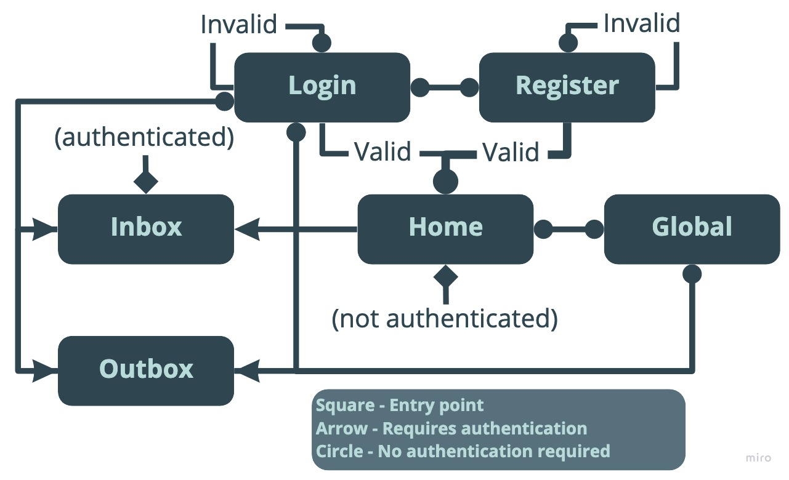

Simun, name based on the childhood game “Simon says”, is an anonymised image sharing random network. Users receive images at random from other users (provided it is amiable) and can then either remove their copy from the network or forward it on to two other users at random. These content items are called snippets. Users can also view interesting metric or facts about what has been shared. This includes current most popular posts, type of posts that are most popular.

All accounts are be anonymous and discourage the sharing of personal information. Signing in will however be required for posting, in order to prevent spamming, bots, and to moderate content. This also provides the opportunity for interpreting trends in related amiability of posts to a viewer.

## Prerequisites

- nodejs (which includes npm). [Example using homebrew for mac users](https://www.dyclassroom.com/howto-mac/how-to-install-nodejs-and-npm-on-mac-using-homebrew)
- [Sass](https://sass-lang.com/), to generate css. To install sass use `sudo gem install sass`.
- Global installations of [standard](https://www.npmjs.com/package/standard), [pug](https://www.npmjs.com/package/pug), [nodemon](https://www.npmjs.com/package/nodemon) and [watchify](https://www.npmjs.com/package/watchify) are required for live development. This can be done via npm via `npm install -g *` with the `*` replaced with each package name respectively.
- To view databases [DBBrowser](https://sqlitebrowser.org/) is recommended.
- For HTTPS a certificate and key are required. Follow this tutorial to install [letsencrypt](https://medium.com/@saurabh6790/generate-wildcard-ssl-certificate-using-lets-encrypt-certbot-273e432794d7) in order to generate them.

## Deployment

### Production

- For HTTPS delivery, a certificate and key will be required to be created and stored in the directory `/etc/letsencrypt/live/simun.co.uk/` as `fullchain.pem` and `privkey.pem` respectively.
- The app listens on port 8080 for HTTP requests and port 8443 for HTTPS requests in order to avoid the security issues of listening directly on port 80 or 443. To redirect the ports to those listening use:
  - `sudo iptables -t nat -A PREROUTING -i eth0 -p tcp --dport 80 -j REDIRECT --to-port 8080`.
  - `sudo iptables -t nat -A PREROUTING -i eth0 -p tcp --dport 443 -j REDIRECT --to-port 8443`.
- Finally, navigate to the `simun/site/` directory, install required modules with `npm install`, then run the server using `sudo screen -r node app.js`.

### Development

- Navigate to the `simun/site/` directory
- Run `npm install` to install required modules. For other modules see prerequisites section above.
- If running locally, change the address in `site/models/identifiers.js` to `http://localhost:8080` (https is not configured) in order to send client requests to the correct destination.
- Run `npm run dev`. This will start the server, dynamically watch for updates to Pug or Sass files and open the login page in browser, and watch for changes in javascript files to compile with nodemon. This page will not be found, Refresh this page after a few seconds once the server has finished starting up. If the login page fails to open automatically then the address will be `http://localhost:8080`.
- Run `npm run tests` to run automated tests.

## Built With

See the [package-lock file](package-lock.json) for all packages.

### Design

- Title and header font is [Glacial-indifference](http://scripts.sil.org/). Body font is [Open Sans](https://fonts.google.com/specimen/Open+Sans).
- Current user flow.
  

## License

I retain my rights of the branding and design, but feel free to reuse parts of the code.
