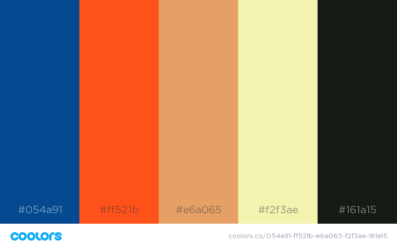

# Simun

Simun, name based on the childhood game “Simon say”’, is a de-personalised social network. Users receive content (images, video or text) at random from other users (provided it is amiable) and can then either remove their copy from the network or forward it on to two other users at random. These content items are called snippets. Users can also view interesting metric or facts about what has been shared. This includes current most popular posts, type of posts that are most popular.

All accounts will be anonymous and discourage the sharing of personal information. Signing in will however be required for posting, in order to prevent spamming, bots, and potentially to moderate content. This will also provide the opportunity for interpreting trends in related amiability of posts to a viewer.

## Prerequisites

- nodejs. [Example using homebrew for mac users](https://www.dyclassroom.com/howto-mac/how-to-install-nodejs-and-npm-on-mac-using-homebrew)
- [Sass](https://sass-lang.com/), to generate css. To install sass do `sudo gem install sass`.
- Global installations of [standard](https://www.npmjs.com/package/standard), pug, nodemon and watchify are required for live development. This can be done by `npm install -g standard` with each package name respectively.
- To view database, download a database viewer, recommendations being `SQLiteManager` or `DBBrowser`.

## Deployment

In order to deploy the development set up:

- Navigate to the site directory
- Run `npm install` to install required modules. For other modules see prerequisites section above
- Run `npm run dev`. This will start the server, dynamically watch for updates to Pug or Sass files and open the login page in browser, and watch for changes in javascript files to compile with nodemon. This page will not be found, Refresh this page after a few seconds once the server has finished starting up. If the login page fails to open automatically then the address will be `http://localhost:7000`
- Run `npm run tests` to run automated tests

## Built With

See the [package-lock file](package-lock.json) for all packages.

### Useful Links

- [Building a NodeJS web app without external packages](https://medium.freecodecamp.org/a-no-frills-guide-to-node-js-how-to-create-a-node-js-web-app-without-external-packages-a7b480b966d2)
- [npm structure suggestions](https://blog.risingstack.com/node-hero-node-js-project-structure-tutorial/)
- [Automated testing](https://hackernoon.com/a-crash-course-on-testing-with-node-js-6c7428d3da02)
- [Markdown cheat sheet](https://github.com/adam-p/markdown-here/wiki/Markdown-Cheatsheet)
- [Readme template](https://gist.github.com/PurpleBooth/109311bb0361f32d87a2)
- [Pug website Github](https://github.com/pugjs/pug-www)

### Design

- Follow this colour sheet in general
  
- Title font is [Glacial-indifference](http://scripts.sil.org/). Main font is [Open Sans](https://fonts.google.com/specimen/Open+Sans).
- Scheme for the database can be found at [here](docs/database-structure.png)

## License

This project is licensed under the GNU GPLv3 license; see LICENSE file for details
